# `crates/ggen-lsp/src/intel/events.rs`

Source SHA-256: `e3e627494e6cc8ceabc0f9d48f771dd37e013c95dd1ba953ec0df2061e3786b2`

```mermaid
classDiagram
    class mod_activity {
      <<mod>>
    }
    class mod_obj_type {
      <<mod>>
    }
    class fn_new_run_id {
      <<fn>>
    }
    class fn_event_id {
      <<fn>>
    }
    class fn_episode_id {
      <<fn>>
    }
    class fn_diag_ref {
      <<fn>>
    }
    class fn_episode_ref {
      <<fn>>
    }
    class fn_file_ref {
      <<fn>>
    }
    class fn_episode_objects {
      <<fn>>
    }
    class fn_route_ref {
      <<fn>>
    }
    class fn_agent_ref {
      <<fn>>
    }
    class struct_Attribution {
      <<struct>>
      +"agent_id: String"
      +"transport: String"
      +"session_id: String"
    }
    class fn_attach_attribution {
      <<fn>>
    }
    class fn_diagnostic_raised {
      <<fn>>
    }
    class fn_route_selected {
      <<fn>>
    }
    class fn_repair_suggested {
      <<fn>>
    }
    class fn_repair_applied {
      <<fn>>
    }
    class fn_receipt_emitted {
      <<fn>>
    }
    class fn_gate_result {
      <<fn>>
    }
    class fn_refusal_emitted {
      <<fn>>
    }
    class mod_tests {
      <<mod>>
    }
    note "Attribution"
```

## Dependencies

- `chrono::Utc`
- `ggen_graph::ocel::{OcelEvent, OcelObjectRef}`
- `std::collections::HashMap`
- `std::sync::atomic::{AtomicU64, Ordering}`
- `std::time::{SystemTime, UNIX_EPOCH}`
- `super::*`

## Standing

- Structural parse: `ALIVE`
- Runtime behavior: `UNKNOWN`
