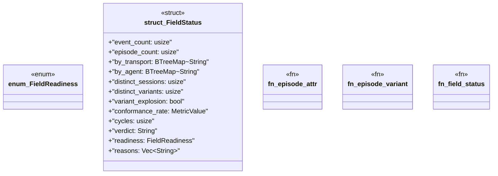

# `crates/ggen-lsp/src/intel/field.rs`

Source SHA-256: `3ace50cf570a170e87e7974424be9a8b77c11fc53c3db8ebb57080e4109ed9ea`

## Dependencies

- `serde::Serialize`
- `std::collections::{BTreeMap, BTreeSet}`
- `super::log::IntelLog`
- `super::metrics::{closed, compute_metrics, group_episodes, Episode, MetricValue}`

## Standing

- Structural parse: `ALIVE`
- Runtime behavior: `UNKNOWN`
