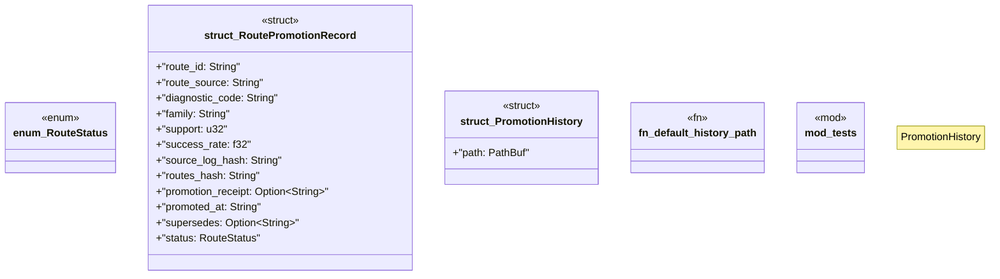

# `crates/ggen-lsp/src/intel/history.rs`

Source SHA-256: `9a70c126777fae5c060dfa460a9df576eb4af10708795128e704230d2348b7de`

## Dependencies

- `serde::{Deserialize, Serialize}`
- `std::fs::{create_dir_all, OpenOptions}`
- `std::io::{self, Write}`
- `std::path::{Path, PathBuf}`
- `super::*`
- `tempfile::TempDir`

## Standing

- Structural parse: `ALIVE`
- Runtime behavior: `UNKNOWN`
