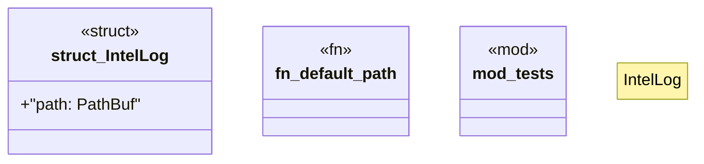

# `crates/ggen-lsp/src/intel/log.rs`

Source SHA-256: `2c94f533404dac78b7afb73cd9a385d8616612357bcfb41aaedc594a3bcd0304`

## Dependencies

- `crate::intel::events::diagnostic_raised`
- `ggen_graph::ocel::{OcelEvent, OcelLog, OcelObject}`
- `std::collections::BTreeMap`
- `std::fs::{create_dir_all, OpenOptions}`
- `std::io::{self, Write}`
- `std::path::{Path, PathBuf}`
- `super::*`
- `tempfile::TempDir`

## Standing

- Structural parse: `ALIVE`
- Runtime behavior: `UNKNOWN`
