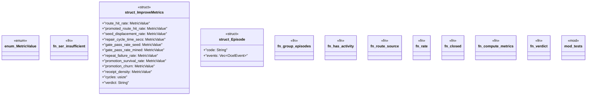

# `crates/ggen-lsp/src/intel/metrics.rs`

Source SHA-256: `63a1408be761bcfbf5139e8b82f5eca36cce9b3a0228cbc41216ac438a5a6d11`

## Dependencies

- `crate::intel::IntelLog`
- `crate::intel::events::{ diagnostic_raised, gate_result, new_run_id, receipt_emitted, route_selected, }`
- `crate::intel::history::{RoutePromotionRecord, RouteStatus}`
- `ggen_graph::ocel::{OcelEvent, OcelLog}`
- `serde::Serialize`
- `std::collections::BTreeMap`
- `super::*`
- `super::events::{activity, obj_type}`
- `super::history::{PromotionHistory, RouteStatus}`
- `super::log::IntelLog`
- `tempfile::TempDir`

## Standing

- Structural parse: `ALIVE`
- Runtime behavior: `UNKNOWN`
