# `crates/ggen-lsp/src/intel/mine.rs`

Source SHA-256: `896a85ba679b46e95ea2279e13c843cd61006ac6d910d8e5de2a2b4fd93744bd`

```mermaid
classDiagram
    class fn_episode_qualifier_iri {
      <<fn>>
    }
    class struct_MineReport {
      <<struct>>
      +"event_count: usize"
      +"failure_edges: Vec~DfgEdge~"
      +"all_edges: Vec~DfgEdge~"
      +"report_path: PathBuf"
      +"promoted_path: PathBuf"
      +"promoted_count: usize"
    }
    class fn_is_failure_target {
      <<fn>>
    }
    class struct_FamilyEvidence {
      <<struct>>
      +"support: u32"
      +"success_rate: f32"
      +"first_seen: String"
      +"last_seen: String"
    }
    class fn_family_evidence {
      <<fn>>
    }
    class fn_episode_closed {
      <<fn>>
    }
    class fn_episode_time_bounds {
      <<fn>>
    }
    class fn_family_slug {
      <<fn>>
    }
    class fn_synthesize_routes {
      <<fn>>
    }
    class fn_mine {
      <<fn>>
    }
    class fn_append_history {
      <<fn>>
    }
    class fn_hash_file {
      <<fn>>
    }
    class fn_emit_promotion_receipt {
      <<fn>>
    }
    class fn_write_report {
      <<fn>>
    }
    class mod_tests {
      <<mod>>
    }
```

## Dependencies

- `crate::intel::events::{diagnostic_raised, gate_result, new_run_id, repair_suggested}`
- `crate::intel::history::{PromotionHistory, RoutePromotionRecord, RouteStatus}`
- `crate::route::is_promotable`
- `crate::route::{ default_pack_routes_path, family_of_code, write_promoted, EditTemplate, PartialOrder, PromotedRoutes, Provenance, RepairFamily, RepairRoute, RepairStep, RouteId, StepId, }`
- `crate::route::{is_promotable, load_promoted}`
- `ggen_graph::ocel::{EvidenceProjector, OcelEvent, OcelLog}`
- `ggen_graph::{check_lifecycle_order, discover_dfg, DeterministicGraph, DfgEdge}`
- `std::collections::BTreeMap`
- `std::path::{Path, PathBuf}`
- `super::*`
- `super::events::{activity, obj_type, EPISODE_QUALIFIER}`
- `super::log::IntelLog`
- `super::receipt::RepairReceipt`
- `tempfile::TempDir`

## Standing

- Structural parse: `ALIVE`
- Runtime behavior: `UNKNOWN`
