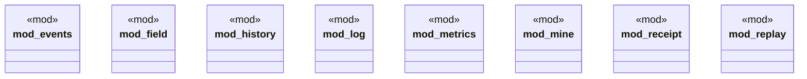

# `crates/ggen-lsp/src/intel/mod.rs`

Source SHA-256: `ca41c59496ebbd6d192a2dc49738cadf6b665567d4ccffd92dd212180242df43`

## Dependencies

- `events::Attribution`
- `field::{field_status, FieldReadiness, FieldStatus}`
- `history::{default_history_path, PromotionHistory, RoutePromotionRecord, RouteStatus}`
- `log::{default_path, IntelLog}`
- `metrics::{compute_metrics, ImproveMetrics, MetricValue}`
- `mine::{mine, MineReport}`
- `receipt::{hash_content, RepairReceipt}`
- `replay::{replay_case, verify_promotion, CaseReplay, PromotionReplay}`

## Standing

- Structural parse: `ALIVE`
- Runtime behavior: `UNKNOWN`
