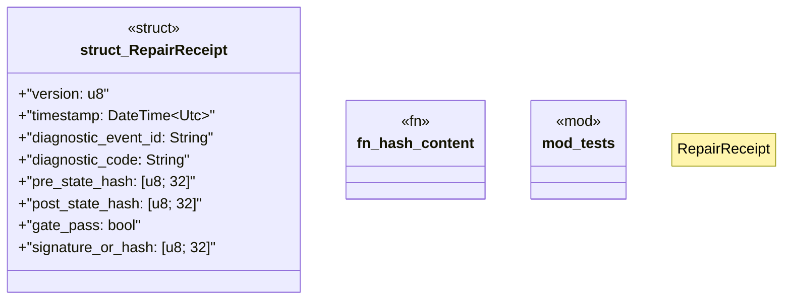

# `crates/ggen-lsp/src/intel/receipt.rs`

Source SHA-256: `d62e450011fcf419f8073d8bd426f8a58663ed01a439c805c3f58471b0a0047a`

## Dependencies

- `chrono::{DateTime, Utc}`
- `serde::{Deserialize, Serialize}`
- `std::fmt::Write as _`
- `super::*`

## Standing

- Structural parse: `ALIVE`
- Runtime behavior: `UNKNOWN`
