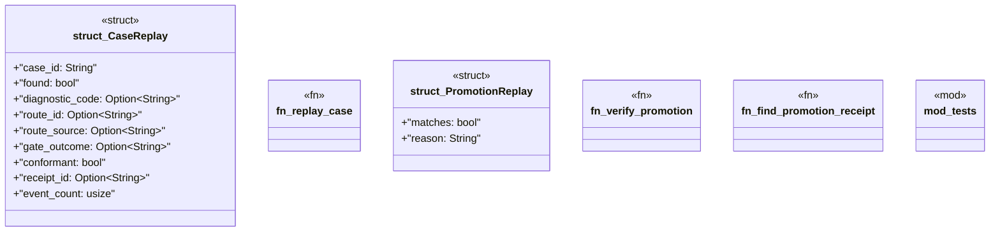

# `crates/ggen-lsp/src/intel/replay.rs`

Source SHA-256: `234e9c173ce17804188b1ee017f96f41f32826c53e0e0ccab1a259bcc3d29bb2`

## Dependencies

- `crate::intel::IntelLog`
- `crate::intel::events::{ diagnostic_raised, gate_result, new_run_id, receipt_emitted, route_selected, }`
- `crate::route::{default_pack_routes_path, PromotedRoutes}`
- `serde::Serialize`
- `std::io::Write`
- `std::path::Path`
- `super::*`
- `super::events::{activity, obj_type}`
- `super::log::IntelLog`
- `tempfile::TempDir`

## Standing

- Structural parse: `ALIVE`
- Runtime behavior: `UNKNOWN`
