# `crates/ggen-lsp/src/lib.rs`

Source SHA-256: `df9d6649b35ddef4c20f35ee969a598f6111aab5d36c5ee2a75a9acb4844c414`

```mermaid
classDiagram
    class mod_analyzers {
      <<mod>>
    }
    class mod_check {
      <<mod>>
    }
    class mod_error {
      <<mod>>
    }
    class mod_features {
      <<mod>>
    }
    class mod_generated_contract {
      <<mod>>
    }
    class mod_handlers {
      <<mod>>
    }
    class mod_harness_index {
      <<mod>>
    }
    class mod_init {
      <<mod>>
    }
    class mod_intel {
      <<mod>>
    }
    class mod_pack {
      <<mod>>
    }
    class mod_project_index {
      <<mod>>
    }
    class mod_route {
      <<mod>>
    }
    class mod_rule_index {
      <<mod>>
    }
    class mod_server {
      <<mod>>
    }
    class mod_source_contract {
      <<mod>>
    }
    class mod_state {
      <<mod>>
    }
    class mod_utils {
      <<mod>>
    }
    class mod_a2a {
      <<mod>>
    }
    class mod_a2a_mcp {
      <<mod>>
    }
    class mod_mcp {
      <<mod>>
    }
```

## Dependencies

- `check::{ capture_request, check_content, check_files, check_files_in_root, check_files_with_routes, discover_law_surfaces, CheckReport, FileReport, RouteSummary, }`
- `init::{init as init_project, InitReport}`
- `intel::{ compute_metrics, field_status, mine, replay_case, verify_promotion, Attribution, CaseReplay, FieldReadiness, FieldStatus, ImproveMetrics, IntelLog, MineReport, PromotionReplay, RepairReceipt, }`
- `lsp_max::{LspService, Server}`
- `pack::{ default_pack_dir, emit as emit_pack, load_manifest, manifest_is_current, pack_hash_at, verify_pack, EmitReport, PackManifest, PackOptions, PackProvenance, PackReplay, PolicyEntry, RouteEntry, DEFAULT_AGENTS, }`
- `route::{ envelope_for_diagnostic, family_of_diagnostic, route_case_id, route_plan_for_diagnostic, RepairFamily, RepairRoute, RouteBindings, RouteEnvelope, RoutePlan, RoutePlanRef, RouteRefusal, RouteRegistry, }`
- `server::GgenLanguageServer`
- `state::ServerState`

## Standing

- Structural parse: `ALIVE`
- Runtime behavior: `UNKNOWN`
