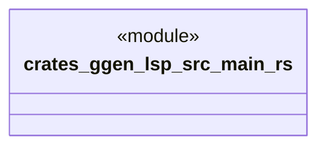

# `crates/ggen-lsp/src/main.rs`

Source SHA-256: `5d9849291e6c20b1ed335819a381675ab369f70ab67646a84036195a9b225c52`

## Dependencies

- `ggen_lsp::run_stdio`
- `std::env`

## Standing

- Structural parse: `ALIVE`
- Runtime behavior: `UNKNOWN`
