# `crates/ggen-lsp/src/mcp/mod.rs`

Source SHA-256: `ef06ed45e74491a22bb0209e64739f55d6f602008039d0ef6f33090c8228839e`

```mermaid
classDiagram
    class struct_RepairRouteParams {
      <<struct>>
      +"file_path: String"
      +"file_content: String"
      +"root: Option~String~"
      +"agent_id: Option~String~"
    }
    class struct_ReplayCaseParams {
      <<struct>>
      +"root: Option~String~"
      +"case_id: Option~String~"
    }
    class struct_MetricsParams {
      <<struct>>
      +"root: Option~String~"
    }
    class struct_RepairRouteServer {
      <<struct>>
      +"tools: Arc~Vec~Tool~~"
    }
    class fn_make_tool {
      <<fn>>
    }
    class fn_repair_route_result {
      <<fn>>
    }
    class fn_parse_repair_params {
      <<fn>>
    }
    class fn_repair_route_captured {
      <<fn>>
    }
    class fn_validate_root {
      <<fn>>
    }
    class fn_validate_case_id {
      <<fn>>
    }
    class fn_replay_case_result {
      <<fn>>
    }
    class fn_metrics_result {
      <<fn>>
    }
    class fn_build_repair_routes {
      <<fn>>
    }
    class fn_build_repair_routes_in {
      <<fn>>
    }
    class mod_tests {
      <<mod>>
    }
    note "Default for RepairRouteServer"
    note "RepairRouteServer"
    note "ServerHandler for RepairRouteServer"
```

## Dependencies

- `rmcp::ServiceExt`
- `rmcp::{model::*, service::RequestContext, ErrorData as McpError, RoleServer, ServerHandler}`
- `schemars::JsonSchema`
- `serde::Deserialize`
- `std::path::{Path, PathBuf}`
- `std::sync::Arc`
- `super::*`

## Standing

- Structural parse: `ALIVE`
- Runtime behavior: `UNKNOWN`
