# `crates/ggen-lsp/src/pack/mod.rs`

Source SHA-256: `c8070fc99f0e7a8c7d7c4bc3141b27024fbf170bafb2551029e3e5b533d6c76d`

```mermaid
classDiagram
    class struct_PackOptions {
      <<struct>>
      +"agents: Vec~String~"
      +"out_dir: PathBuf"
      +"scan_hash: Option~String~"
    }
    class struct_PolicyEntry {
      <<struct>>
      +"path: String"
      +"hash: String"
    }
    class struct_RouteEntry {
      <<struct>>
      +"route_id: String"
      +"family: String"
      +"source: String"
    }
    class struct_PackManifest {
      <<struct>>
      +"version: u8"
      +"canon: String"
      +"pack_hash: String"
      +"law_surfaces: Vec~String~"
      +"policies: Vec~PolicyEntry~"
      +"routes: Vec~RouteEntry~"
    }
    class struct_PackProvenance {
      <<struct>>
      +"version: u8"
      +"scan_hash: String"
      +"pack_hash: String"
    }
    class struct_EmitReport {
      <<struct>>
      +"out_dir: String"
      +"agents: Vec~String~"
      +"files_written: Vec~String~"
      +"pack_hash: String"
      +"receipt_sig: Option~String~"
    }
    class fn_emit {
      <<fn>>
    }
    class fn_compute_pack_hash {
      <<fn>>
    }
    class fn_emit_pack_receipt {
      <<fn>>
    }
    class struct_PackReplay {
      <<struct>>
      +"matches: bool"
      +"reason: String"
    }
    class fn_verify_pack {
      <<fn>>
    }
    class fn_find_pack_receipt {
      <<fn>>
    }
    class fn_lsp_config_json {
      <<fn>>
    }
    class fn_default_pack_dir {
      <<fn>>
    }
    class fn_build_manifest {
      <<fn>>
    }
    class fn_load_manifest {
      <<fn>>
    }
    class fn_manifest_is_current {
      <<fn>>
    }
    class fn_pack_hash_at {
      <<fn>>
    }
    class fn_write_file {
      <<fn>>
    }
    class fn_set_executable {
      <<fn>>
    }
    class fn_set_executable {
      <<fn>>
    }
    class mod_tests {
      <<mod>>
    }
    note "Default for PackOptions"
    note "PackManifest"
    note "PackProvenance"
```

## Dependencies

- `serde::Serialize`
- `std::io`
- `std::os::unix::fs::PermissionsExt`
- `std::path::{Path, PathBuf}`
- `super::*`
- `tempfile::TempDir`

## Standing

- Structural parse: `ALIVE`
- Runtime behavior: `UNKNOWN`
