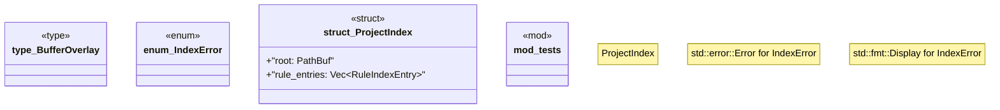

# `crates/ggen-lsp/src/project_index.rs`

Source SHA-256: `0596d1e31a73b68dcb68d96c08847b531d6fcf66da8a2761e10cae5062fab8d1`

## Dependencies

- `crate::rule_index::RuleIndexEntry`
- `ggen_config::{manifest::ManifestParser, ConfigSchemaClassification}`
- `std::collections::BTreeSet`
- `std::path::{Path, PathBuf}`
- `super::*`
- `tempfile::TempDir`

## Standing

- Structural parse: `ALIVE`
- Runtime behavior: `UNKNOWN`
