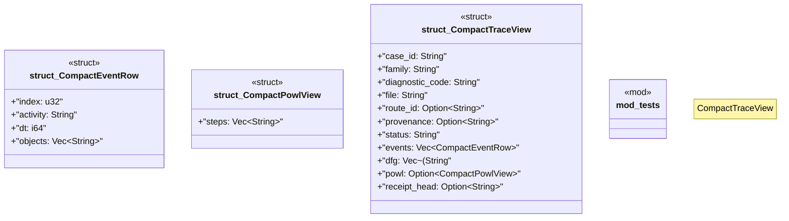

# `crates/ggen-lsp/src/route/compact.rs`

Source SHA-256: `02067b11e8aeae038157f3ed52b6f094a03b443fe089523bc0c57a62c54a0340`

## Dependencies

- `crate::route::model::{ EditTemplate, PartialOrder, Provenance, RepairFamily, RepairRoute, RepairStep, RouteBindings, RouteId, StepId, }`
- `crate::route::{edit::route_plan, plan::DiagnosticRef}`
- `lsp_max::lsp_types::{Position, Range}`
- `serde::{Deserialize, Serialize}`
- `super::*`
- `super::model::Provenance`
- `super::plan::RoutePlan`

## Standing

- Structural parse: `ALIVE`
- Runtime behavior: `UNKNOWN`
