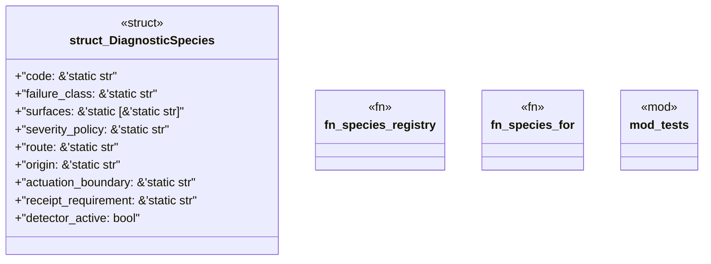

# `crates/ggen-lsp/src/route/diagnostic_species.rs`

Source SHA-256: `c9f30f714d9b4b078042b379a27eb4cdb3a972cfd36c2e99f30cfcf450aced66`

## Dependencies

- `super::*`

## Standing

- Structural parse: `ALIVE`
- Runtime behavior: `UNKNOWN`
