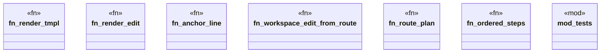

# `crates/ggen-lsp/src/route/edit.rs`

Source SHA-256: `c981a180e37746693c2b0e48852c6e306a6b150a44fda76646b071ae92d7f76e`

## Dependencies

- `lsp_max::lsp_types::{Position, Range, TextEdit, Url, WorkspaceEdit}`
- `std::collections::HashMap`
- `super::*`
- `super::model::{Anchor, EditTemplate, PartialOrder, RepairRoute, RouteBindings}`
- `super::plan::{DiagnosticRef, RoutePlan, RoutePlanStep}`
- `super::super::model::{ EditTemplate, PartialOrder, Provenance, RepairFamily, RepairRoute, RepairStep, RouteId, StepId, }`

## Standing

- Structural parse: `ALIVE`
- Runtime behavior: `UNKNOWN`
