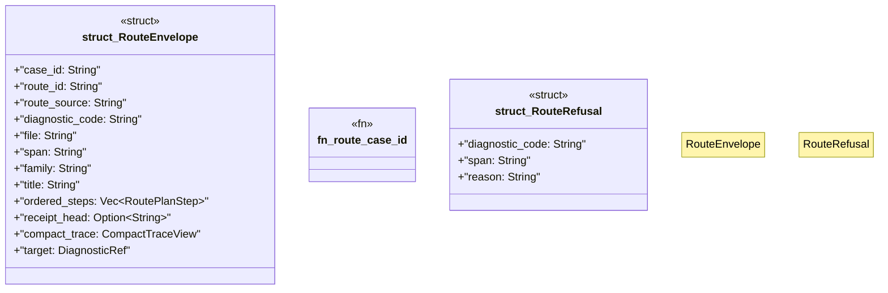

# `crates/ggen-lsp/src/route/envelope.rs`

Source SHA-256: `f13ba314748496acba775f87a480f6ccddf151bfe8051638597afb260c6af6a7`

## Dependencies

- `serde::{Deserialize, Serialize}`
- `super::compact::CompactTraceView`
- `super::plan::{DiagnosticRef, RoutePlan, RoutePlanStep}`

## Standing

- Structural parse: `ALIVE`
- Runtime behavior: `UNKNOWN`
