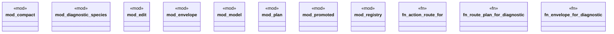

# `crates/ggen-lsp/src/route/mod.rs`

Source SHA-256: `ea56e839bd65759319dc85ec242615a1a75e8300dd5d29b1a95f47af85963cad`

## Dependencies

- `compact::{CompactEventRow, CompactPowlView, CompactTraceView}`
- `diagnostic_species::{species_for, species_registry, DiagnosticSpecies}`
- `edit::{render_edit, route_plan, workspace_edit_from_route}`
- `envelope::{route_case_id, RouteEnvelope, RouteRefusal}`
- `lsp_max::lsp_types::Diagnostic`
- `model::{ Anchor, EditTemplate, PartialOrder, Provenance, RepairFamily, RepairRoute, RepairStep, RouteBindings, RouteId, StepId, }`
- `plan::{DiagnosticRef, RoutePlan, RoutePlanRef, RoutePlanStep}`
- `promoted::{ default_pack_routes_path, is_promotable, load_promoted, promotion, write_promoted, PromotedRoutes, }`
- `registry::{family_of_code, family_of_diagnostic, RouteRegistry}`

## Standing

- Structural parse: `ALIVE`
- Runtime behavior: `UNKNOWN`
