# `crates/ggen-lsp/src/route/model.rs`

Source SHA-256: `f7e06f5955366e20b40f0f9a59a0b72f70bf9913f07329702e4a46fd99095813`

```mermaid
classDiagram
    class struct_RouteId {
      <<struct>>
    }
    class struct_StepId {
      <<struct>>
    }
    class enum_RepairFamily {
      <<enum>>
    }
    class enum_Provenance {
      <<enum>>
    }
    class enum_EditTemplate {
      <<enum>>
    }
    class enum_Anchor {
      <<enum>>
    }
    class struct_RepairStep {
      <<struct>>
      +"id: StepId"
      +"title: String"
      +"edit: EditTemplate"
    }
    class struct_PartialOrder {
      <<struct>>
      +"nodes: Vec~RepairStep~"
      +"edges: Vec~(StepId"
    }
    class struct_RepairRoute {
      <<struct>>
      +"id: RouteId"
      +"family: RepairFamily"
      +"steps: PartialOrder"
      +"description: String"
      +"provenance: Provenance"
      +"priority: i32"
    }
    class struct_RouteBindings {
      <<struct>>
      +"site: Option~Range~"
      +"prefix: Option~String~"
      +"iri: Option~String~"
      +"symbol: Option~String~"
    }
    class mod_tests {
      <<mod>>
    }
    note "PartialOrder"
```

## Dependencies

- `lsp_max::lsp_types::Range`
- `serde::{Deserialize, Serialize}`
- `super::*`

## Standing

- Structural parse: `ALIVE`
- Runtime behavior: `UNKNOWN`
