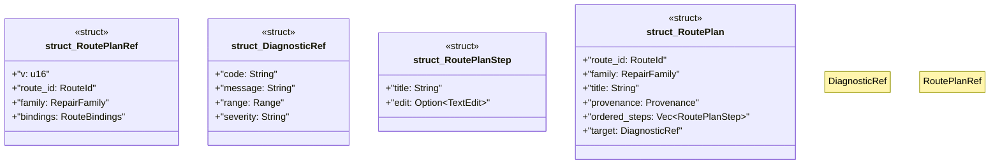

# `crates/ggen-lsp/src/route/plan.rs`

Source SHA-256: `6a6bad9393cebea2e6f64991645424835b9ed5e4e2fec24c2b49a1adac6e9147`

## Dependencies

- `lsp_max::lsp_types::{Diagnostic, DiagnosticSeverity, NumberOrString, Range, TextEdit}`
- `serde::{Deserialize, Serialize}`
- `super::model::{Provenance, RepairFamily, RouteBindings, RouteId}`

## Standing

- Structural parse: `ALIVE`
- Runtime behavior: `UNKNOWN`
