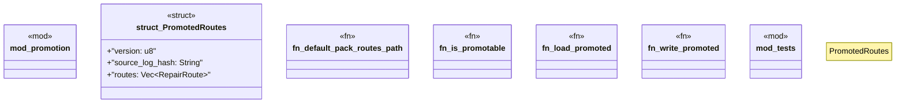

# `crates/ggen-lsp/src/route/promoted.rs`

Source SHA-256: `bb438a1504b1a6f5e2b76a04e57599ff0b0648d88c9712441fd5c176ded217c4`

## Dependencies

- `crate::route::model::{PartialOrder, RepairFamily, RepairRoute, RouteId}`
- `serde::{Deserialize, Serialize}`
- `std::path::{Path, PathBuf}`
- `super::*`
- `super::model::{Provenance, RepairRoute}`

## Standing

- Structural parse: `ALIVE`
- Runtime behavior: `UNKNOWN`
