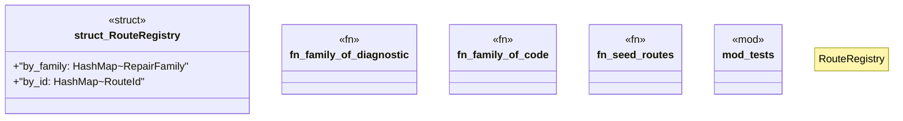

# `crates/ggen-lsp/src/route/registry.rs`

Source SHA-256: `72db194209a61aded3077f291aab620e08462c8f983fb47b6b1d4381f9048fd5`

## Dependencies

- `crate::route::promoted::{default_pack_routes_path, write_promoted, PromotedRoutes}`
- `lsp_max::lsp_types::{Diagnostic, NumberOrString}`
- `lsp_max::lsp_types::{DiagnosticSeverity, Position, Range}`
- `std::collections::HashMap`
- `std::path::Path`
- `super::*`
- `super::model::{ Anchor, EditTemplate, PartialOrder, Provenance, RepairFamily, RepairRoute, RepairStep, RouteId, StepId, }`
- `super::promoted::{is_promotable, load_promoted}`

## Standing

- Structural parse: `ALIVE`
- Runtime behavior: `UNKNOWN`
