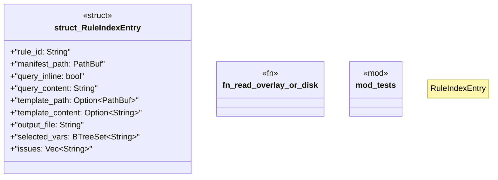

# `crates/ggen-lsp/src/rule_index.rs`

Source SHA-256: `00dd4e24b526c154538ff0847754889587b2587c55860b2c812145c8666ca2fd`

## Dependencies

- `crate::project_index::BufferOverlay`
- `ggen_config::manifest::{GenerationRule, QuerySource, TemplateSource}`
- `std::collections::BTreeSet`
- `std::path::{Path, PathBuf}`
- `super::*`
- `tempfile::TempDir`

## Standing

- Structural parse: `ALIVE`
- Runtime behavior: `UNKNOWN`
