# `crates/ggen-lsp/src/server.rs`

Source SHA-256: `282c7f074cabd0efe5b68e62b7fc7d1f66b294ec2e5928e4085a66a0de31644b`

```mermaid
classDiagram
    class struct_RegistryDocumentState {
      <<struct>>
      +"diagnostic_ids: HashSet~String~"
      +"gating_ids: HashSet~String~"
    }
    class struct_GgenLanguageServer {
      <<struct>>
      +"state: Arc~ServerState~"
      +"client: Client"
      +"registry_documents: Arc~Mutex~HashMap~Url"
      +"hierarchy_registrations: Arc~Mutex~Vec~Registration~~~"
      +"source_contract_flagged: Arc~Mutex~HashSet~Url~~~"
    }
    class fn_client_supports_capability {
      <<fn>>
    }
    class fn_client_capability_bool {
      <<fn>>
    }
    class fn_diagnostic_key {
      <<fn>>
    }
    class fn_coalesce_publications {
      <<fn>>
    }
    class fn_diagnostic_id {
      <<fn>>
    }
    class fn_is_ggen_manifest {
      <<fn>>
    }
    class fn_is_rust_source {
      <<fn>>
    }
    class fn_is_source_contract_trigger {
      <<fn>>
    }
    class fn_document_uri_to_path {
      <<fn>>
    }
    class fn_url_from_path {
      <<fn>>
    }
    class fn_write_gate {
      <<fn>>
    }
    class fn_gate_file_path {
      <<fn>>
    }
    class fn_range_contains {
      <<fn>>
    }
    class mod_tests {
      <<mod>>
    }
    note "GgenLanguageServer"
    note "LanguageServer for GgenLanguageServer"
```

## Dependencies

- `crate::handlers`
- `crate::project_index::BufferOverlay`
- `crate::state::ServerState`
- `lsp_max::lsp_types_max::*`
- `lsp_max::{jsonrpc::Result, Client, LanguageServer}`
- `lsp_max_protocol::LawAxis`
- `std::collections::{HashMap, HashSet}`
- `std::path::{Path, PathBuf}`
- `std::sync::Arc`
- `super::*`
- `tokio::sync::Mutex`

## Standing

- Structural parse: `ALIVE`
- Runtime behavior: `UNKNOWN`
