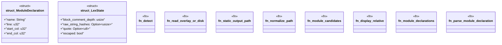

# `crates/ggen-lsp/src/source_contract.rs`

Source SHA-256: `15bb4977476619183a2a89bb5841a0d7c9f96d89fa54c97c44d8be08e86265da`

## Dependencies

- `crate::analyzers::diag::{self, Span}`
- `crate::analyzers::source_law_analyzer::GGEN_SRC_004`
- `crate::project_index::{BufferOverlay, ProjectIndex}`
- `crate::rule_index::RuleIndexEntry`
- `lsp_max::lsp_types_max::DiagnosticSeverity`
- `lsp_max_protocol::{LawAxis, MaxDiagnostic}`
- `std::collections::HashSet`
- `std::path::{Component, Path, PathBuf}`
- `super::*`
- `tempfile::TempDir`

## Standing

- Structural parse: `ALIVE`
- Runtime behavior: `UNKNOWN`
