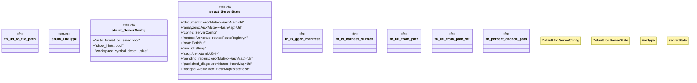

# `crates/ggen-lsp/src/state.rs`

Source SHA-256: `f259329b9924794691e2028d76c10504bccd55ab481e90268eefbe3f7cca7535`

## Dependencies

- `crate::analyzers::DocumentAnalyzer`
- `crate::intel::events::{ diagnostic_raised, gate_result, receipt_emitted, repair_applied, repair_suggested, route_selected, }`
- `crate::project_index::BufferOverlay`
- `lsp_max::lsp_types_max::*`
- `lsp_max_protocol::MaxDiagnostic`
- `std::collections::{HashMap, HashSet}`
- `std::path::{Path, PathBuf}`
- `std::sync::Arc`
- `std::sync::atomic::{AtomicU64, Ordering}`
- `tokio::sync::Mutex`

## Standing

- Structural parse: `ALIVE`
- Runtime behavior: `UNKNOWN`
