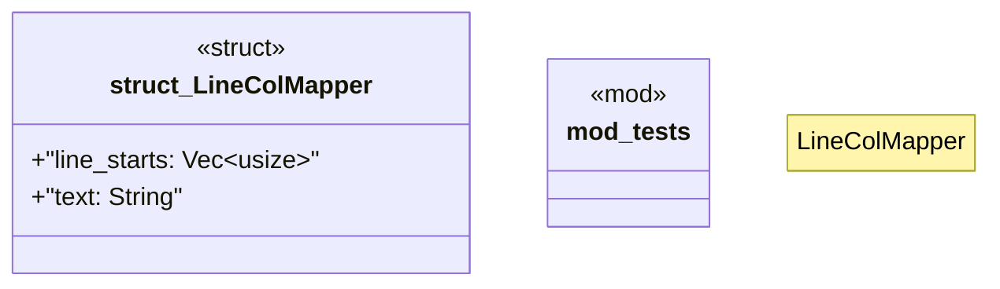

# `crates/ggen-lsp/src/utils.rs`

Source SHA-256: `169fc795a526caa29e7135a6b5b032698ba45a2c44eb76edda8fe2fb0fd14052`

## Dependencies

- `lsp_max::lsp_types::Position`
- `super::*`

## Standing

- Structural parse: `ALIVE`
- Runtime behavior: `UNKNOWN`
