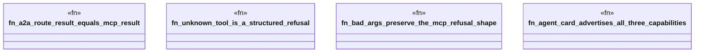

# `crates/ggen-lsp/tests/a2a_bridge_test.rs`

Source SHA-256: `852d8ea57bb28d30e42a4efce55428462b575bc940f8229db9553a1e15594857`

## Dependencies

- `ggen_lsp::a2a::{agent_card, dispatch_tool, RepairRouteAdapter}`
- `ggen_lsp::a2a_mcp::a2a_generated::adapter::Adapter`
- `serde_json::json`

## Standing

- Structural parse: `ALIVE`
- Runtime behavior: `UNKNOWN`
