# `crates/ggen-lsp/tests/a2a_gall_foundation_test.rs`

Source SHA-256: `f882e6de4c6d74309cd363f62dba33c96c091d8c6a7ef03ad1ca3fb82ef0bcbc`

```mermaid
classDiagram
    class fn_playground_root {
      <<fn>>
    }
    class fn_fixture {
      <<fn>>
    }
    class fn_root_str {
      <<fn>>
    }
    class fn_lsp_route {
      <<fn>>
    }
    class fn_mcp_route {
      <<fn>>
    }
    class fn_a2a_route {
      <<fn>>
    }
    class fn_envelope_scalars {
      <<fn>>
    }
    class fn_gall_playground_broken_construct_routes_same_across_lsp_mcp_a2a {
      <<fn>>
    }
    class fn_gall_clean_playground_surface_has_no_blocking_route {
      <<fn>>
    }
    class fn_gall_mcp_tool_list_contains_repair_replay_metrics {
      <<fn>>
    }
    class fn_gall_a2a_bridge_matches_mcp_for_repair_route {
      <<fn>>
    }
    class fn_gall_lsp_mcp_a2a_preserve_route_id {
      <<fn>>
    }
    class fn_gall_delivery_plane_uses_current_identity {
      <<fn>>
    }
```

## Dependencies

- `ggen_lsp::a2a::{agent_card, dispatch_tool, RepairRouteAdapter, TOOLS}`
- `ggen_lsp::a2a_mcp::a2a_generated::adapter::Adapter`
- `serde_json::{json, Value}`
- `std::path::{Path, PathBuf}`

## Standing

- Structural parse: `ALIVE`
- Runtime behavior: `UNKNOWN`
