# `crates/ggen-lsp/tests/a2a_mcp_pack_tools_test.rs`

Source SHA-256: `f4acdf6ed3c848dacaaa16f9fe8a708b28e6c8027f1ff2acfb6407934055e583`

```mermaid
classDiagram
    class fn_block_on {
      <<fn>>
    }
    class fn_seed_lockfile {
      <<fn>>
    }
    class fn_emit_receipt {
      <<fn>>
    }
    class fn_dispatch_capabilities_returns_the_operation_set {
      <<fn>>
    }
    class fn_dispatch_status_reads_a_real_lockfile_via_root {
      <<fn>>
    }
    class fn_dispatch_verify_validates_a_real_receipt_via_root {
      <<fn>>
    }
    class fn_dispatch_verify_tampered_receipt_is_invalid {
      <<fn>>
    }
    class fn_dispatch_unknown_tool_is_rejected {
      <<fn>>
    }
    class fn_dispatch_install_with_invalid_pack_id_is_fail_closed {
      <<fn>>
    }
    class fn_agent_card_advertises_exactly_the_dispatchable_tools {
      <<fn>>
    }
    class fn_adapter_handles_pack_tools_and_disclaims_foreign_ones {
      <<fn>>
    }
    class fn_adapter_from_a2a_routes_a_task_to_the_facade {
      <<fn>>
    }
    class fn_adapter_from_a2a_without_tool_is_rejected {
      <<fn>>
    }
```

## Dependencies

- `ggen_lsp::a2a_mcp::a2a_generated::adapter::Adapter`
- `ggen_lsp::a2a_mcp::{dispatch_pack_tool, pack_agent_card, PackToolsAdapter, PACK_TOOLS}`
- `ggen_marketplace::agent::{emit_install_receipt, PackInstallClosure}`
- `serde_json::json`
- `std::fs`
- `std::path::{Path, PathBuf}`
- `tempfile::TempDir`

## Standing

- Structural parse: `ALIVE`
- Runtime behavior: `UNKNOWN`
