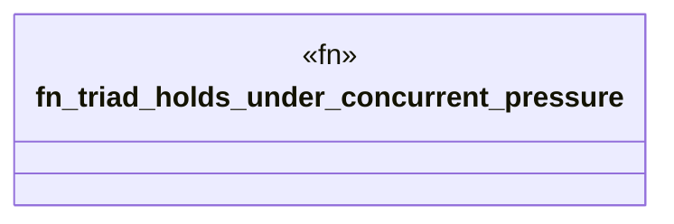

# `crates/ggen-lsp/tests/a2a_triad_stress_test.rs`

Source SHA-256: `7b188cd27695dee5544d9167842515c26e02e29d494806714b5a66692985adc2`

## Dependencies

- `ggen_lsp::a2a::dispatch_tool`
- `ggen_lsp::intel::events::obj_type`
- `ggen_lsp::mcp::build_repair_routes_in`
- `ggen_lsp::{check_files_in_root, replay_case, Attribution, IntelLog}`
- `serde_json::json`
- `std::fs`
- `std::thread`
- `tempfile::TempDir`

## Standing

- Structural parse: `ALIVE`
- Runtime behavior: `UNKNOWN`
