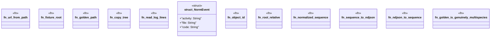

# `crates/ggen-lsp/tests/consolidate_002_sequence_equivalence.rs`

Source SHA-256: `494faa46d3c9ef8da9ecb1900fed074757c283d30e013b42bf2a6423db40b984`

## Dependencies

- `ggen_lsp::ServerState`
- `lsp_max::lsp_types::Url`
- `std::path::{Path, PathBuf}`

## Standing

- Structural parse: `ALIVE`
- Runtime behavior: `UNKNOWN`
