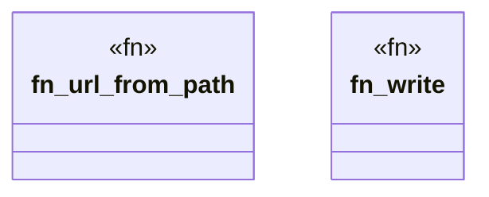

# `crates/ggen-lsp/tests/demote_test.rs`

Source SHA-256: `9388f2b1db637dc70a218ee0019ed7fde4c112ca49ceea053f739fa093dcb450`

## Dependencies

- `ggen_lsp::intel::{MetricValue, PromotionHistory, RouteStatus}`
- `ggen_lsp::route::{default_pack_routes_path, RouteRegistry}`
- `ggen_lsp::state::ServerState`
- `ggen_lsp::{check_content, check_files_in_root, compute_metrics, mine}`
- `lsp_max::lsp_types::Url`
- `std::fs`
- `std::path::{Path, PathBuf}`
- `tempfile::TempDir`

## Standing

- Structural parse: `ALIVE`
- Runtime behavior: `UNKNOWN`
