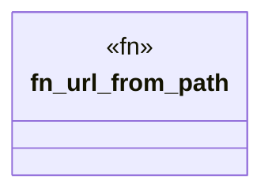

# `crates/ggen-lsp/tests/editor_apply_test.rs`

Source SHA-256: `185ed8990b9bea789b7cd3c7e4a7141f569e96ced70b477cdc2a7a69f4eabeb4`

## Dependencies

- `ggen_lsp::intel::MetricValue`
- `ggen_lsp::intel::events::activity`
- `ggen_lsp::state::ServerState`
- `ggen_lsp::{check_content, compute_metrics, IntelLog}`
- `lsp_max::lsp_types::Url`
- `tempfile::TempDir`

## Standing

- Structural parse: `ALIVE`
- Runtime behavior: `UNKNOWN`
