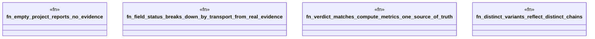

# `crates/ggen-lsp/tests/field_status_test.rs`

Source SHA-256: `371285db6c403ba8728a38159a6ff0b846ef9e7208c06175145b8d44c4ce0faa`

## Dependencies

- `ggen_lsp::intel::MetricValue`
- `ggen_lsp::{ capture_request, check_files_in_root, compute_metrics, field_status, Attribution, FieldReadiness, }`
- `std::fs`
- `std::path::Path`
- `tempfile::TempDir`

## Standing

- Structural parse: `ALIVE`
- Runtime behavior: `UNKNOWN`
