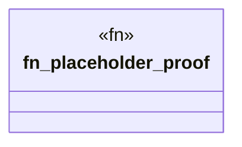

# `crates/ggen-lsp/tests/fixtures/ggen_harness_001_living_loop/valid_project/tests/proof/run.rs`

Source SHA-256: `c6f00eee4edfc1b64f91f1b11507a5fd15c4a0021281df51b5d7749650052a83`

## Dependencies

- None observed.

## Standing

- Structural parse: `ALIVE`
- Runtime behavior: `UNKNOWN`
