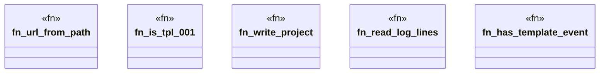

# `crates/ggen-lsp/tests/ggen_live_buffer_001.rs`

Source SHA-256: `729ac0b486743ca4044f018bbcca633baa959180a091e712c3513ab21b662be4`

## Dependencies

- `ggen_lsp::ServerState`
- `lsp_max::lsp_types::{NumberOrString, Url}`
- `lsp_max_protocol::MaxDiagnostic`
- `std::path::Path`

## Standing

- Structural parse: `ALIVE`
- Runtime behavior: `UNKNOWN`
