# `crates/ggen-lsp/tests/ggen_pack_001_living_loop.rs`

Source SHA-256: `6fc0928a8f947a8c3f4107a549b4784edfe1b4b685c0d2f1dcf654adc569f86a`

```mermaid
classDiagram
    class fn_minimal_ontology {
      <<fn>>
    }
    class fn_ggen_toml_with_pack_query {
      <<fn>>
    }
    class fn_ggen_toml_with_pack_template {
      <<fn>>
    }
    class fn_ggen_toml_with_inline_query {
      <<fn>>
    }
    class fn_pack_001_warns_when_query_is_pack_sourced {
      <<fn>>
    }
    class fn_pack_001_warns_when_template_is_pack_sourced {
      <<fn>>
    }
    class fn_pack_001_not_raised_for_inline_query {
      <<fn>>
    }
    class fn_pack_001_message_contains_rule_id_and_pack_info {
      <<fn>>
    }
```

## Dependencies

- `ggen_lsp::check::{check_files_in_root, discover_law_surfaces}`
- `lsp_max::lsp_types`
- `std::fs`
- `tempfile::TempDir`

## Standing

- Structural parse: `ALIVE`
- Runtime behavior: `UNKNOWN`
