# `crates/ggen-lsp/tests/ggen_query_002_living_loop.rs`

Source SHA-256: `e2632a7657746a51856fd33c7de5fd4b65172bd4650e2c8bc49936464f1865fd`

```mermaid
classDiagram
    class fn_is_query_002 {
      <<fn>>
    }
    class fn_is_tpl_001 {
      <<fn>>
    }
    class fn_count_diag {
      <<fn>>
    }
    class fn_write_project {
      <<fn>>
    }
    class fn_select_star_raises_query_002_through_headless_gate {
      <<fn>>
    }
    class fn_explicit_select_does_not_raise_query_002 {
      <<fn>>
    }
    class fn_select_star_causes_tpl_001_false_positive_flood_blindspot_proven {
      <<fn>>
    }
    class fn_explicit_select_restores_tpl_001_detection {
      <<fn>>
    }
```

## Dependencies

- `ggen_lsp::check::{check_files_in_root, discover_law_surfaces, CheckReport}`
- `lsp_max::lsp_types::{Diagnostic, DiagnosticSeverity, NumberOrString}`
- `std::path::Path`

## Standing

- Structural parse: `ALIVE`
- Runtime behavior: `UNKNOWN`
