# `crates/ggen-lsp/tests/ggen_rule_001_living_loop.rs`

Source SHA-256: `58123a1a6fc37c4a1c9512d48f891aa28b2718f048132f31fd8c9a7b60e5c777`

```mermaid
classDiagram
    class fn_url_from_path {
      <<fn>>
    }
    class fn_fixture_root {
      <<fn>>
    }
    class fn_other_fixture {
      <<fn>>
    }
    class fn_is_code {
      <<fn>>
    }
    class fn_count_code_in_report {
      <<fn>>
    }
    class fn_has_rule_001_error_in_report {
      <<fn>>
    }
    class fn_rule_001_diag {
      <<fn>>
    }
    class fn_copy_tree {
      <<fn>>
    }
    class fn_read_log_lines {
      <<fn>>
    }
    class fn_has_manifest_event {
      <<fn>>
    }
    class fn_missing_rule_file_raises_rule_001_through_headless_gate {
      <<fn>>
    }
    class fn_missing_rule_file_raises_zero_other_species {
      <<fn>>
    }
    class fn_creating_missing_file_clears_rule_001_through_headless_gate {
      <<fn>>
    }
    class fn_rule_001_route_is_source_law_only {
      <<fn>>
    }
    class fn_headless_gate_never_materializes_output {
      <<fn>>
    }
    class fn_valid_rule_bindings_stay_clean {
      <<fn>>
    }
    class fn_other_species_fixtures_raise_zero_rule_001 {
      <<fn>>
    }
```

## Dependencies

- `ggen_lsp::ServerState`
- `ggen_lsp::check::{check_files_in_root, discover_law_surfaces, CheckReport}`
- `ggen_lsp::route::{Provenance, RouteRegistry}`
- `lsp_max::lsp_types::{Diagnostic, DiagnosticSeverity, NumberOrString, Position, Range, Url}`
- `std::path::{Path, PathBuf}`

## Standing

- Structural parse: `ALIVE`
- Runtime behavior: `UNKNOWN`
