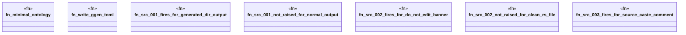

# `crates/ggen-lsp/tests/ggen_src_001_003_living_loop.rs`

Source SHA-256: `111b9a32cbb0f45194d06f9be1e5fab892748209c0b558aaea5312f4b8e0abc7`

## Dependencies

- `ggen_lsp::check::{check_files_in_root, discover_law_surfaces}`
- `lsp_max::lsp_types`
- `std::fs`
- `tempfile::TempDir`

## Standing

- Structural parse: `ALIVE`
- Runtime behavior: `UNKNOWN`
