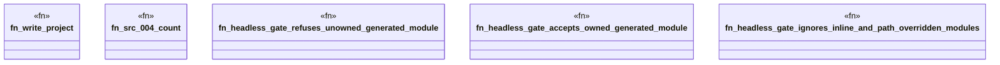

# `crates/ggen-lsp/tests/ggen_src_004_living_loop.rs`

Source SHA-256: `931aef26848bd1c1732899053a99609cad9bd464ab94f0b79d4f6cd513c42b6e`

## Dependencies

- `ggen_lsp::check::{check_files_in_root, discover_law_surfaces}`
- `lsp_max::lsp_types::{DiagnosticSeverity, NumberOrString}`
- `std::fs`
- `tempfile::TempDir`

## Standing

- Structural parse: `ALIVE`
- Runtime behavior: `UNKNOWN`
