# `crates/ggen-lsp/tests/ggen_tpl_001.rs`

Source SHA-256: `0edf77fbb2f61a67505a030cda33ab160101a893feb10cfae4fbaed9534d0ac5`

```mermaid
classDiagram
    class fn_fixture_root {
      <<fn>>
    }
    class fn_load {
      <<fn>>
    }
    class fn_is_tpl_001 {
      <<fn>>
    }
    class fn_count_tpl_001 {
      <<fn>>
    }
    class fn_has_tpl_001_error {
      <<fn>>
    }
    class fn_valid_rule_emits_no_tpl_001 {
      <<fn>>
    }
    class fn_unbound_template_var_emits_tpl_001_error {
      <<fn>>
    }
    class fn_inline_query_valid_emits_no_tpl_001 {
      <<fn>>
    }
    class fn_missing_template_file_is_index_issue_not_tpl_001 {
      <<fn>>
    }
    class fn_analysis_never_materializes_output_file {
      <<fn>>
    }
    class fn_output_path_unbound_emits_out_001 {
      <<fn>>
    }
    class fn_copy_tree {
      <<fn>>
    }
```

## Dependencies

- `ggen_lsp::analyzers::{detect_out_001, detect_tpl_001}`
- `ggen_lsp::project_index::ProjectIndex`
- `lsp_max::lsp_types::{Diagnostic, DiagnosticSeverity, NumberOrString}`
- `lsp_max_protocol::MaxDiagnostic`
- `std::path::{Path, PathBuf}`

## Standing

- Structural parse: `ALIVE`
- Runtime behavior: `UNKNOWN`
