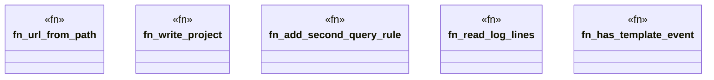

# `crates/ggen-lsp/tests/ggen_tpl_001_did_close_clear.rs`

Source SHA-256: `ee627f851fb24c3b38775be0e8c121f64d8bf56bd3c7087712f9b4134956fb9a`

## Dependencies

- `ggen_lsp::ServerState`
- `lsp_max::lsp_types::Url`
- `std::fs`
- `std::path::Path`
- `tempfile::TempDir`

## Standing

- Structural parse: `ALIVE`
- Runtime behavior: `UNKNOWN`
