# `crates/ggen-lsp/tests/ggen_tpl_001_living_loop.rs`

Source SHA-256: `34ea519f135f248a80d06cca39e8b7debbaec78fa0c387884400efe1d713961d`

```mermaid
classDiagram
    class fn_url_from_path {
      <<fn>>
    }
    class fn_fixture_root {
      <<fn>>
    }
    class fn_is_tpl_001 {
      <<fn>>
    }
    class fn_count_tpl_001_in_report {
      <<fn>>
    }
    class fn_has_tpl_001_error_in_report {
      <<fn>>
    }
    class fn_tpl_001_diag {
      <<fn>>
    }
    class fn_copy_tree {
      <<fn>>
    }
    class fn_write_project {
      <<fn>>
    }
    class fn_read_log_lines {
      <<fn>>
    }
    class fn_has_template_event {
      <<fn>>
    }
    class fn_invalid_template_raises_tpl_001_through_headless_gate {
      <<fn>>
    }
    class fn_repaired_template_clears_tpl_001_through_headless_gate {
      <<fn>>
    }
    class fn_tpl_001_route_is_source_law_only {
      <<fn>>
    }
    class fn_headless_gate_never_materializes_output_file {
      <<fn>>
    }
```

## Dependencies

- `ggen_lsp::ServerState`
- `ggen_lsp::check::{check_files_in_root, discover_law_surfaces, CheckReport}`
- `ggen_lsp::route::{Provenance, RouteRegistry}`
- `lsp_max::lsp_types::{Diagnostic, DiagnosticSeverity, NumberOrString, Position, Range, Url}`
- `std::path::{Path, PathBuf}`

## Standing

- Structural parse: `ALIVE`
- Runtime behavior: `UNKNOWN`
