# `crates/ggen-lsp/tests/ggen_tpl_001_regression.rs`

Source SHA-256: `fc4a81c9cceba87d00fe041a9d8c1f54a287e2d75b81dd68bdfacda25b063995`

```mermaid
classDiagram
    class fn_fixture_root {
      <<fn>>
    }
    class fn_load {
      <<fn>>
    }
    class fn_code_str {
      <<fn>>
    }
    class fn_all_codes {
      <<fn>>
    }
    class fn_copy_tree {
      <<fn>>
    }
    class fn_tpl_001_diag {
      <<fn>>
    }
    class fn_out_001_is_active_in_species_registry {
      <<fn>>
    }
    class fn_tpl_detector_never_emits_out_001 {
      <<fn>>
    }
    class fn_out_detector_silent_on_static_output_path_of_tpl_fixture {
      <<fn>>
    }
    class fn_harness_001_is_active {
      <<fn>>
    }
    class fn_detect_tpl_001_runs_without_any_child_lsp {
      <<fn>>
    }
    class fn_valid_fixture_stays_clean {
      <<fn>>
    }
    class fn_invalid_fixture_emits_only_tpl_001 {
      <<fn>>
    }
    class fn_analysis_writes_no_emitted_output_files {
      <<fn>>
    }
    class fn_tpl_001_route_targets_only_source_law {
      <<fn>>
    }
```

## Dependencies

- `ggen_lsp::analyzers::{detect_out_001, detect_tpl_001}`
- `ggen_lsp::project_index::ProjectIndex`
- `ggen_lsp::route::{species_for, EditTemplate, RouteRegistry}`
- `lsp_max::lsp_types::{Diagnostic, DiagnosticSeverity, NumberOrString, Position, Range}`
- `lsp_max_protocol::MaxDiagnostic`
- `std::path::{Path, PathBuf}`

## Standing

- Structural parse: `ALIVE`
- Runtime behavior: `UNKNOWN`
