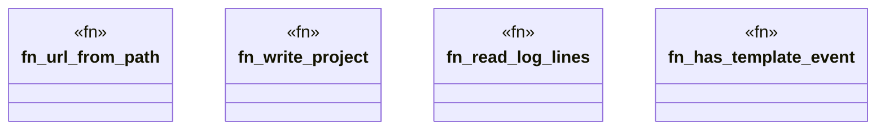

# `crates/ggen-lsp/tests/ggen_tpl_001_stale_clear.rs`

Source SHA-256: `f535ee692b304bd75ad96ecf15ddc7c4b2b94fafa7d4f9ef85f75431d98e1a31`

## Dependencies

- `ggen_lsp::ServerState`
- `ggen_lsp::analyzers::detect_tpl_001`
- `ggen_lsp::project_index::ProjectIndex`
- `lsp_max::lsp_types::Url`
- `std::collections::HashSet`
- `std::fs`
- `std::path::Path`
- `tempfile::TempDir`

## Standing

- Structural parse: `ALIVE`
- Runtime behavior: `UNKNOWN`
