# `crates/ggen-lsp/tests/ggen_yield_001_living_loop.rs`

Source SHA-256: `9ed8a50334102f6f285363bebc39afbd006b85e1c905d1d7c385b3b03ef7bd15`

```mermaid
classDiagram
    class fn_is_yield_001 {
      <<fn>>
    }
    class fn_count_yield_001 {
      <<fn>>
    }
    class fn_has_yield_001_error {
      <<fn>>
    }
    class fn_write_project {
      <<fn>>
    }
    class fn_escaping_output_file_raises_yield_001_through_headless_gate {
      <<fn>>
    }
    class fn_in_project_output_file_produces_no_yield_001 {
      <<fn>>
    }
    class fn_absolute_escaping_output_file_raises_yield_001 {
      <<fn>>
    }
    class fn_headless_gate_never_materializes_output_file {
      <<fn>>
    }
```

## Dependencies

- `ggen_lsp::check::{check_files_in_root, discover_law_surfaces, CheckReport}`
- `lsp_max::lsp_types::{Diagnostic, DiagnosticSeverity, NumberOrString}`
- `std::path::Path`

## Standing

- Structural parse: `ALIVE`
- Runtime behavior: `UNKNOWN`
