# `crates/ggen-lsp/tests/ggen_yield_003_005_living_loop.rs`

Source SHA-256: `26823951b40ebe83483e137f5ccea3d4fe0e44d27bf1e8aea0ff26ed0bea23f1`

```mermaid
classDiagram
    class fn_minimal_ontology {
      <<fn>>
    }
    class fn_has_code {
      <<fn>>
    }
    class fn_yield_003_fires_for_orphaned_output {
      <<fn>>
    }
    class fn_yield_003_not_raised_for_valid_output {
      <<fn>>
    }
    class fn_yield_004_fires_for_competing_rules {
      <<fn>>
    }
    class fn_yield_004_not_raised_for_unique_outputs {
      <<fn>>
    }
    class fn_yield_005_fires_for_remote_url {
      <<fn>>
    }
    class fn_yield_005_not_raised_for_local_path {
      <<fn>>
    }
```

## Dependencies

- `ggen_lsp::check::{check_files_in_root, discover_law_surfaces}`
- `lsp_max::lsp_types`
- `std::fs`
- `tempfile::TempDir`

## Standing

- Structural parse: `ALIVE`
- Runtime behavior: `UNKNOWN`
